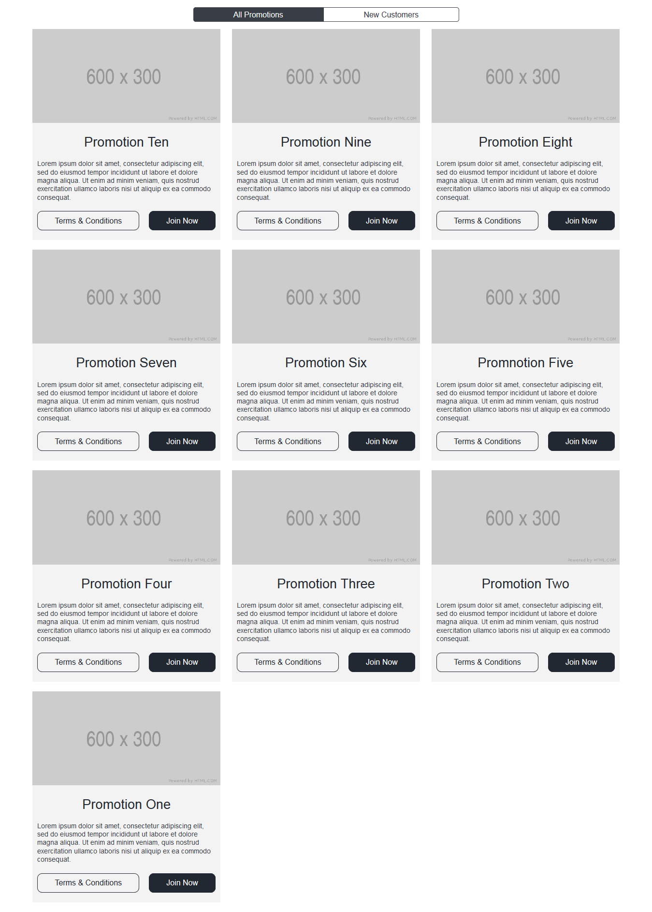
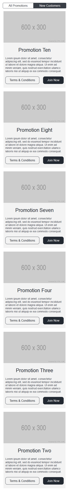

# Teste da empresa Addison Global

Resolvi fazer este projeto no intuito de praticar e melhorar minhas habilidades com as tecnologias que serão usadas para desenvolve-lo.

Este projeto é baseado em um teste para cadidatos há uma vaga de desenvolvedor front-end, na empresa [Addison Global](http://www.addisongloballtd.com/). Retirei este teste do repositório [frontend-challenges](https://github.com/felipefialho/frontend-challenges), criado pelo [Felipe Fialho](https://github.com/felipefialho).

[Repositório do teste.](https://github.com/addisonglobal/web-technical-test)

## Tecnologias

- HTML
- CSS
- JavaScript

## Objetivo

Criar uma página de promoções responsiva, que consiste em duas visualizações com base no filtro de promoções. Quando a página for carregada, deve ser feita uma requisição há o [endpoint](http://www.mocky.io/v2/5bc3b9cc30000012007586b7) que contém as informações das promoções. Depois que a requisição for finalizada, as promoções devem ser renderizadas para o usuário.

Haverá dois tipos de filtros para as promoções na página, um filtro para novos usuários e um padrão que é de todas as promoções, as promoções serão exibidas para o usuário com base no filtro selecionado.

## Imagens

